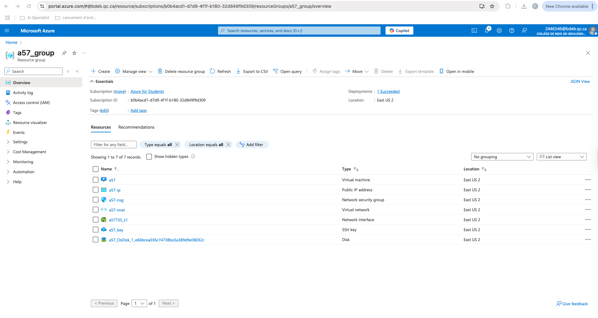
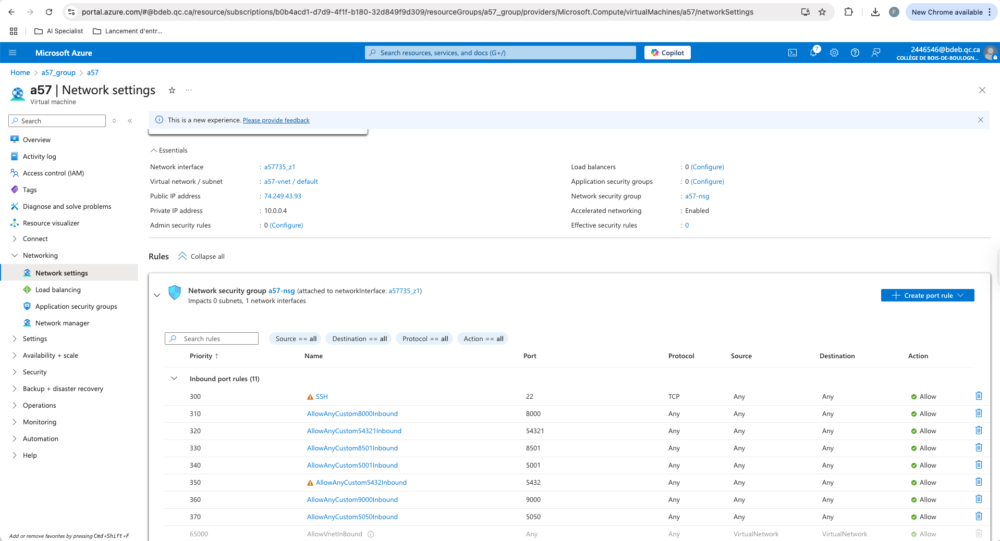
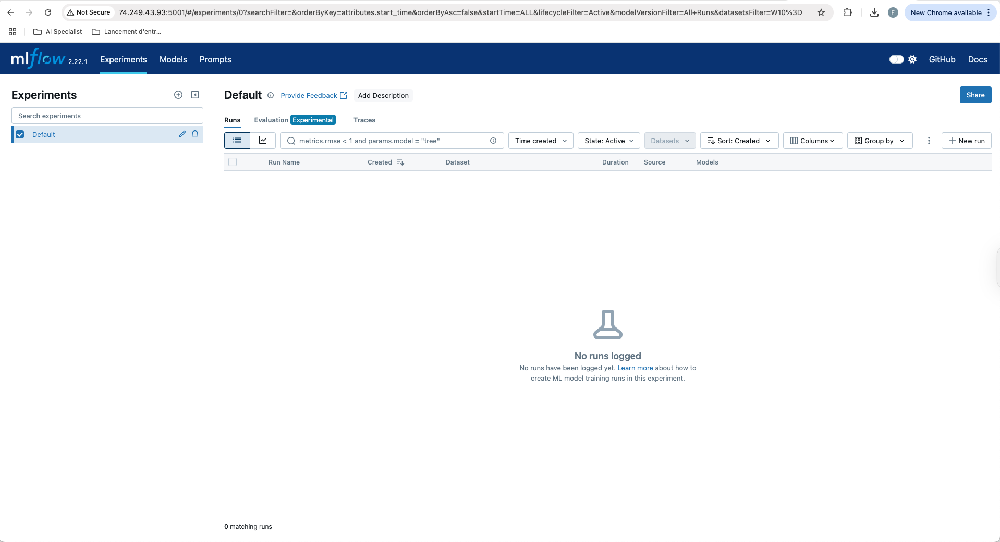
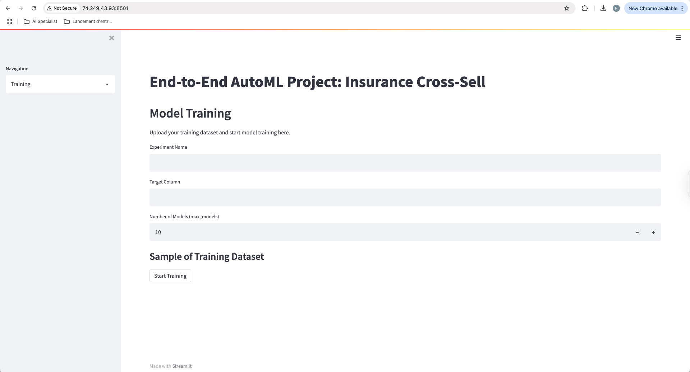
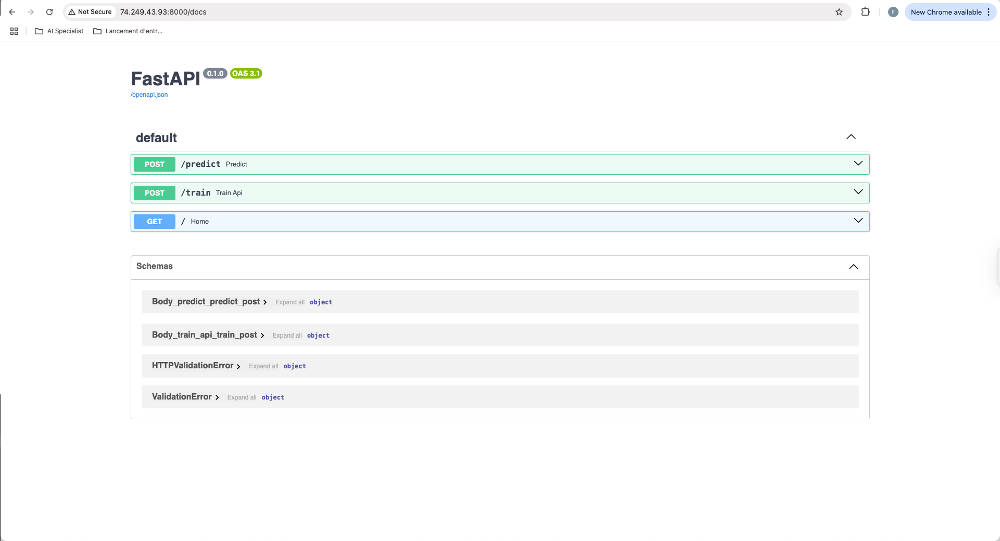
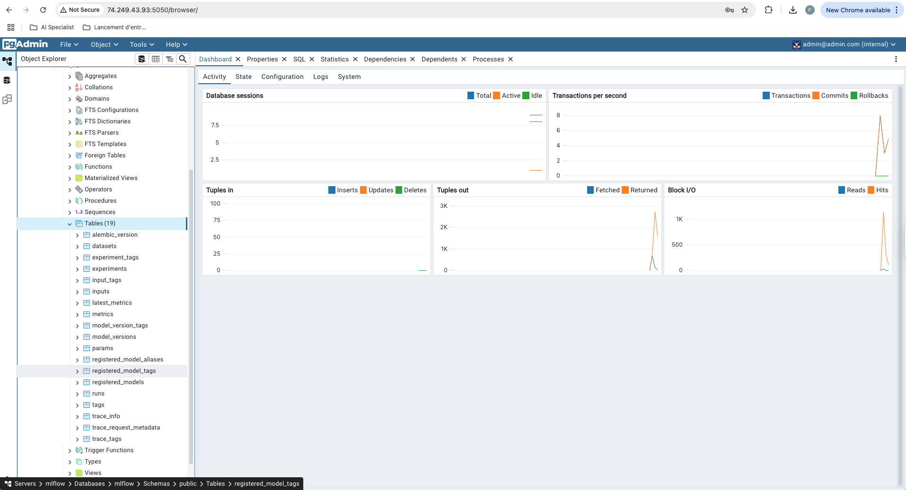

# Projet Final A57

## Intro

## Configuration de la VM Azure

### Creation de la VN sur azure

### Ajout des ports

## Config Repo Git

### Code source

### Ajout des secrets dans GitHub

### Ajout des Runner pour le Self-Hosted

## Mlflow

## Streamlit

## FastApi

## Postgres

