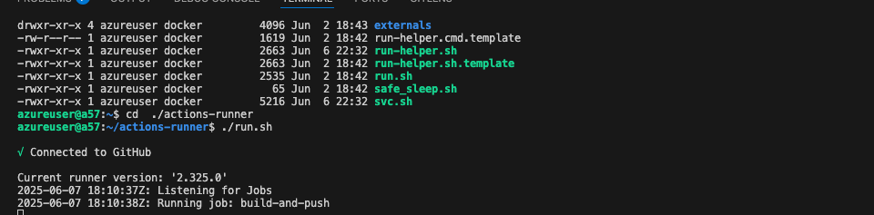

# Projet Final A57

## Introduction

Ce projet final, réalisé dans le cadre du cours A57, a pour objectif de concevoir, déployer et gérer une application complète de machine learning sur le cloud Azure. Il met en œuvre un pipeline de bout en bout intégrant la gestion du code source, l’automatisation des déploiements, le suivi des expériences, l’exposition d’API, la visualisation des résultats et l’intégration de services d’intelligence artificielle avancés via OpenAI. L’intégration d’OpenAI à Mlflow permet de suivre, versionner et comparer les expériences utilisant les modèles d’IA générative, facilitant ainsi l’évaluation et la reproductibilité des résultats. Le projet exploite des technologies modernes telles que Mlflow (avec support OpenAI), Streamlit, FastAPI, Postgres et Portainer pour offrir une solution robuste, évolutive et facilement maintenable.

## Description du projet

L’application développée permet de :

- Gérer et versionner le code source via GitHub.
- Automatiser les déploiements grâce à des workflows CI/CD avec des runners self-hosted sur Azure.
- Suivre les expériences de machine learning et gérer les modèles avec Mlflow.
- Proposer une interface utilisateur interactive pour la visualisation et l’interaction avec les modèles via Streamlit.
- Exposer des API RESTful pour l’inférence en temps réel avec FastAPI.
- Stocker les données, résultats et métadonnées dans une base de données Postgres.
- Superviser les conteneurs et services déployés à l’aide de Portainer.

## Objectifs du projet

- Déployer une machine virtuelle (VM) sur Azure pour héberger l’ensemble des services.
- Configurer un réseau virtuel sécurisé et ouvrir les ports nécessaires pour chaque composant.
- Mettre en place une gestion sécurisée des secrets et accès via GitHub.
- Assurer la reproductibilité, la traçabilité et la facilité de déploiement des modèles ML.

## Structure du projet

La structure du projet est organisée comme suit :

``` python
tp-final-a57/
├── .github/           # Workflows CI/CD
├── app/               # Code source de l’application (FastAPI, Streamlit)
├── ml/                # Scripts de machine learning et gestion des expériences Mlflow
├── infra/             # Scripts d’infrastructure (déploiement VM, réseau, etc.)
├── data/              # Jeux de données et résultats
├── docs/              # Documentation et captures d’écran
├── Dockerfile         # Fichiers Docker pour les différents services
├── requirements.txt   # Dépendances Python
└── README.md          # Présentation du projet
```

## Comment démarrer le projet

### Les prérequis

Avant de démarrer le projet, assurez-vous de disposer des éléments suivants :

- **Git installé**  
    Téléchargez et installez Git depuis [git-scm.com](https://git-scm.com/).

- **Compte Azure**  
    Créez un compte Azure ([azure.microsoft.com](https://azure.microsoft.com/)) et provisionnez une VM pour héberger les services du projet.

- **Clé API OpenAI**  
    Inscrivez-vous sur [platform.openai.com](https://platform.openai.com/) pour obtenir une clé API permettant d’utiliser les services d’IA générative.

- **Compte Docker Hub**  
    Créez un compte sur [hub.docker.com](https://hub.docker.com/) pour stocker et récupérer les images Docker nécessaires au déploiement.

- **Docker et Docker Compose installés**  
    Installez Docker et Docker Compose sur votre machine ou sur la VM cible ([docs.docker.com/get-docker/](https://docs.docker.com/get-docker/)).

- **Accès SSH à la VM**  
    Générez une paire de clés SSH pour accéder à la VM Azure de façon sécurisée.

### Cloner le dépôt

``` bash
    git clone https://github.com/fayeboua/tp-final-a57.git
    cd tp-final-a57
```

### Creation de la VM Azure

Déploiement d’une VM dédiée et configuration d’un réseau virtuel pour isoler et sécuriser l’environnement.


### Tableau des ports utilisés

| Service     | Port par défaut | Description                                 |
|-------------|----------------|---------------------------------------------|
| Streamlit   | 8501           | Interface web pour la visualisation         |
| Mlflow      | 50001          | Suivi et gestion des expériences ML         |
| FastAPI     | 8000           | API RESTful pour l’inférence                |
| Postgres    | 5432           | Base de données relationnelle               |
| Portainer   | 9000           | Supervision et gestion des conteneurs Docker|

> **Remarque :** Assurez-vous d’ouvrir ces ports dans la configuration réseau de la VM Azure pour permettre l’accès aux différents services.


### Configurer les variables d’environnement et secrets GitHub

Ajout des secrets (clés API, identifiants, etc.) dans la section "Secrets" de GitHub pour sécuriser les workflows CI/CD.

| Nom du secret   | Description                                 |
|-----------------|---------------------------------------------|
| AZURE_HOST      | Adresse de la machine virtuelle Azure        |
| DH_TOKEN        | Jeton d’accès Docker Hub                     |
| DH_USERNAME     | Nom d’utilisateur Docker Hub                 |
| SSH_KEY         | Clé SSH privée pour l’accès à la VM          |
| OPEN_AI_KEY     | Clé API pour accéder aux services OpenAI     |


### Configuration des runners self-hosted

Déploiement de runners GitHub auto-hébergés sur la VM Azure pour exécuter les pipelines d’intégration et de déploiement continus.

```bash
    # Create a folder
    $ mkdir actions-runner && cd actions-runner# Download the latest runner package
    $ curl -o actions-runner-linux-x64-2.325.0.tar.gz -L https://github.com/actions/runner/releases/download/v2.325.0/actions-runner-linux-x64-2.325.0.tar.gz# Optional: Validate the hash
    $ echo "5020da7139d85c776059f351e0de8fdec753affc9c558e892472d43ebeb518f4  actions-runner-linux-x64-2.325.0.tar.gz" | shasum -a 256 -c# Extract the installer
    $ tar xzf ./actions-runner-linux-x64-2.325.0.tar.gz
```


```bash
    # Create the runner and start the configuration experience
    $ ./config.sh --url https://github.com/fayeboua/tp-final-a57 --token <VOTRE_TOKEN_ICI>
    # Last step, run it!
    $ ./run.sh
```




### Deploiement automatique de l'application

5. **Lancer les services :**
    - Construire et démarrer les conteneurs Docker :

      ```bash
      docker-compose up --build
      ```

    - Accéder aux interfaces web (Streamlit, Mlflow, Portainer, etc.) via les ports configurés.

### Versionnement du code

Le code source est hébergé sur GitHub, facilitant la collaboration et le suivi des modifications.


### Gestion des secrets GitHub

## Suivi des expériences avec Mlflow

Mlflow est utilisé pour enregistrer, comparer et gérer les différentes expériences de machine learning, assurant la reproductibilité et la traçabilité des modèles.


## Interface utilisateur avec Streamlit

Développement d’une interface web interactive avec Streamlit pour visualiser les résultats, explorer les données et interagir avec les modèles déployés.


## API d’inférence avec FastAPI

FastAPI expose des endpoints RESTful permettant d’effectuer des inférences à partir d’applications externes ou de scripts automatisés.


## Stockage des données avec Postgres

Postgres sert de base de données centrale pour stocker les données d’entrée, les résultats des prédictions et les métadonnées du projet.


## Supervision avec Portainer

Portainer est utilisé pour superviser et gérer les conteneurs Docker déployés sur la VM, facilitant l’administration et la maintenance des services.


